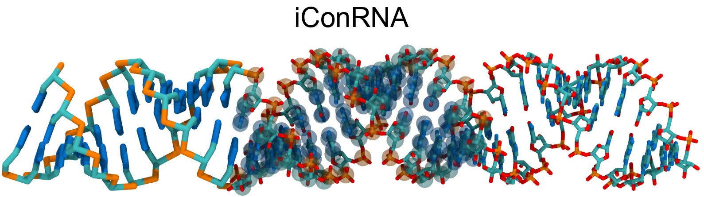

# Intermediate resolution model for Condensation of RNA (iConRNA)
       

## About
iConRNA (**i**ntermediate resolution model for **Con**densates of **RNA**) is developed for modeling RNA condensation with explicit Mg2+ ions.   
iConRNA was developed by Shanlong Li and Jianhan Chen in the [Chen Lab](https://people.chem.umass.edu/jchenlab/)   
For more information, please take a look at our paper:   
**[S. Li, & J. Chen, Driving forces of RNA condensation revealed through coarse-grained modeling with explicit Mg2+, Proc. Natl. Acad. Sci. U.S.A. 122 (43) e2504583122, (2025).](https://www.pnas.org/doi/10.1073/pnas.2504583122)**
## 0. dependencies
1. [HyresBuilder](https://github.com/lslumass/HyresBuilder)
2. [psfgen-python](https://psfgen.robinbetz.com/)
3. [CHARMM-GUI](https://www.charmm-gui.org/)
4. [OpenMM 8.2.0](https://github.com/openmm/openmm)

## 1. create CG PDB file
### A. for disordered RNA
create CG RNA chain using "RNAbuilder" function of [HyresBuilder](https://github.com/lslumass/HyresBuilder).  
**example**: [build_CG_RNA.py](./script/build_CG_RNA.py)  

### B. for structured RNA
1. open CHARMM-GUI and sign in.
2. select Input Generator --> PDB Reader&Manipulator
3. here, input the PDB id or upload the PDB file, and then NEXT>NEXT>  
4. here, one can choose any chains needed, NEXT>
5. in this step, choose the 5PHO as the 5' terminal groups ("Terminal group patching").
6. download the PDB file labeled as "CHARMM PDB".  
7. convert it to CG model using [at2cg_RNA.py](./script/at2cg_RNA.py)  
```python at2cg_RNA.py input_AA_pdb output_CG_pdb```

## 2. create PSF file
[psfgen_iConRNA.py](./script/psfgen_iConRNA.py) was used to create the psf files for various systems.  
```
usage: psfgen_iConRNA.py [-h] -i INPUT_PDB_FILES [INPUT_PDB_FILES ...] -o OUTPUT_PSF_FILE [-n NUM_OF_CHAINS [NUM_OF_CHAINS ...]]

generate PSF for Hyres systems

optional arguments:
  -h, --help            show this help message and exit
  -i INPUT_PDB_FILES [INPUT_PDB_FILES ...], --input_pdb_files INPUT_PDB_FILES [INPUT_PDB_FILES ...]
  -o OUTPUT_PSF_FILE, --output_psf_file OUTPUT_PSF_FILE
  -n NUM_OF_CHAINS [NUM_OF_CHAINS ...], --num_of_chains NUM_OF_CHAINS [NUM_OF_CHAINS ...]; Number of copies for each pdb; it should have the same length as the given pdb list specified in the '-i' argument (default: [1])
```
**Here are some examples:**
1. generate PSF for a single-chain RNA
```
python psfgen_iConRNA.py -i conf.pdb -o conf.psf
```
2. generate PSF for a multi-chain protein
```
python psfgen_iConRNA.py -i chainA.pdb chainB.pdb -o complex.psf
```
3. generate PSF for LLPS simulation of one kind of protein
```
python psfgen_iConRNA.py -i monomer.pdb -n 100 -o llps.psf
```
4. generate PSF for LLPS simulation of multiple kinds of protein
```
# 20 copies of chain A + 30 copies of chain B
python psfgen_iConRNA.py -i chainA.pdb chainB.pdb -n 20 30 -o conf.psf
```

## 3. run the simulation
[run.py](./script/run.py) was created to run the simulation.  
```
usage: run.py [-h] [-c PDB] [-p PSF] [-t TEMP] [-b BOX [BOX ...]] [-s SALT] [-e ENS] [-m MG]

optional arguments:
  -h, --help            show this help message and exit
  -c PDB, --pdb PDB     pdb file, default is conf.pdb
  -p PSF, --psf PSF     psf file, default is conf.psf
  -t TEMP, --temp TEMP  system temperature, default is 303 K
  -b BOX [BOX ...], --box BOX [BOX ...]; box dimensions in nanometer, e.g., '50' for cubic box, '100 20 20' for rectangle box
  -s SALT, --salt SALT  salt concentration in mM, default is 150 mM
  -e ENS, --ens ENS     simulation ensemble, NPT, NVT, or non, non is for non-periodic system, default is NVT
  -m MG, --Mg MG        Mg2+ concentration in mM, default is 0.0
```

**example:**  
NVT system in a 50 nm cubic box under 25 mM NaCl and 10 mM MgCl2 at 303 K.   
```python run.py -c conf.pdb -p conf.psf -t 303 -b 50 -s 25 -e NVT -m 10```
